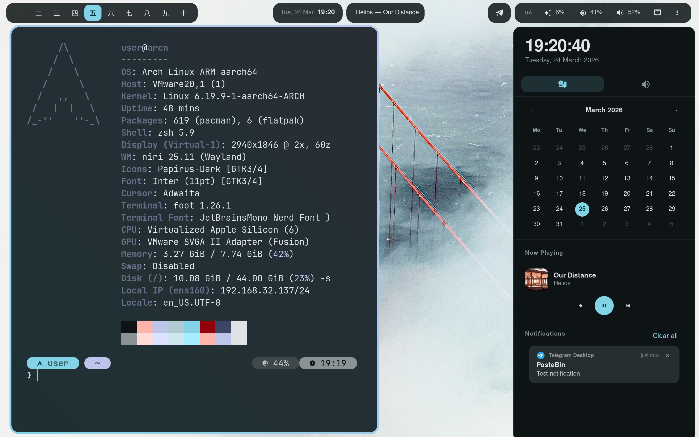

<h1 align="center">dots-niri</h1>

<p align="center">
  <b>Minimal, dynamic Arch Linux rice</b><br>
  Niri + AGS + Material You
</p>

<p align="center">
  
  
  
  
</p>

<br>

<p align="center">
  
</p>

<br>

## Overview

|  |  |
|---|---|
| **Compositor** | [Niri](https://github.com/YaLTeR/niri) — scrollable tiling Wayland compositor |
| **Widgets** | [AGS v3](https://github.com/Aylur/ags) (Astal) — bar, launcher, sidebar, notifications, clipboard |
| **Colors** | [Matugen](https://github.com/InioX/matugen) — Material You palette from wallpaper |
| **Terminal** | [Foot](https://codeberg.org/dnkl/foot) |
| **Shell** | Zsh + Starship + Zoxide |
| **Font** | JetBrainsMono Nerd Font |
| **Wallpaper** | [swww](https://github.com/LGFae/swww) with transition effects |

## Features

- **Dynamic theming** — change wallpaper, entire desktop recolors instantly (bar, terminal, GTK apps)
- **Right-click "Set as Wallpaper"** in Thunar — sets wallpaper + regenerates colors
- **Scrollable tiling** — Niri's infinite horizontal workspace
- **App launcher** with fuzzy search (Flatpak apps included)
- **Clipboard manager** with image preview and search
- **Media controls** — MPRIS player widget in bar + sidebar
- **Sidebar** — calendar, quick settings, notifications

## Keybinds

| Key | Action |
|-----|--------|
| `Mod+T` | Terminal |
| `Mod+E` | File manager |
| `Mod+D` | App launcher |
| `Mod+N` | Sidebar |
| `Mod+C` | Clipboard |
| `Mod+O` | Overview |
| `Mod+W` | Random wallpaper |
| `Mod+Shift+S` | Screenshot (area) |
| `Print` | Screenshot (full) |

## Structure

```
.
├── ags/          # Bar, launcher, sidebar, notifications, clipboard (TSX + SCSS)
├── foot/         # Terminal config + fallback colors
├── matugen/      # Material You templates (niri, foot, ags, gtk, starship)
├── niri/         # Compositor config (KDL)
├── scripts/      # set-bg.sh, nvim-foot, desktop entries
├── thunar/       # Custom action: Set as Wallpaper
├── wallpapers/   # Bundled wallpapers
├── zsh/          # .zshrc
└── install.sh    # Full setup script
```

## Installation

```bash
git clone https://github.com/tarzZan52/dots-niri.git ~/dots-niri
cd ~/dots-niri
chmod +x install.sh
./install.sh
```

The script handles everything: packages (pacman + AUR), stow symlinks, AGS dependencies, Material You color generation, shell setup, portal config for Flatpak, and more.

Flags:
- `--stow-only` — skip package installation, only deploy symlinks
- `--install-only` — install packages but don't stow

After install, log out and start **niri** from TTY.

> [!WARNING]
> This script has only been tested on **fresh Arch Linux VMs** (x86_64 and aarch64).
> It has **not** been tested on bare-metal or existing installations.
> Use at your own risk — review the script before running.

## How colors work

1. `set-bg.sh` sets the wallpaper via swww
2. Matugen extracts a Material You palette from the image
3. Templates regenerate configs for: Niri borders, Foot colors, AGS SCSS variables, GTK CSS, Starship prompt
4. AGS hot-reloads CSS, Foot picks up color changes, Niri auto-reloads

Change wallpaper anytime with `Mod+W` or right-click an image in Thunar.

## Credits

- [Niri](https://github.com/YaLTeR/niri) by YaLTeR
- [AGS](https://github.com/Aylur/ags) by Aylur
- [Matugen](https://github.com/InioX/matugen) by InioX
- [swww](https://github.com/LGFae/swww) by LGFae
